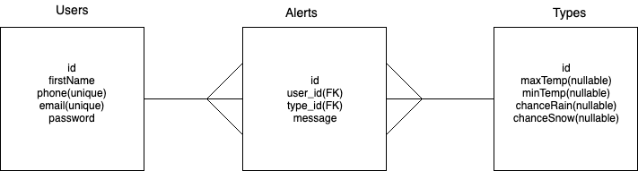

# my-weather-buddy

Problem Statement: The weather can change dramatically and quickly. One day can be sunny and warm, while the next day freezing. It can challenging to plan to dress appropriatly. The solution is to create an app that sends a user weather alerts based on the criteria of their choosing.

Routes Plan:
- Fetch the 5 day forecast from OpenWeather every night at 7pm(SetInterval)
- Have server every night at 7pm check if tomorrow's weather data meets criteria(SetInterval)
- POST route "/create/:email" to create user
- POST route "/alert/:userID" to create alert
- Delete route "/alert/:alertID"
- PATCH route "/alert/:alertID"
- Get route "user/:id" for display of alerts
* All current data will be reflected in database.

https://trello.com/b/t3px7iXE/myweather-buddy

Technologies Used:
- React-Native
- Node/PostgreSQL/Express/Knex
- OpenWeather API
- Twilio API
- Google Geocoordinates API or Google Places API
- NPM Font Awesome
- React-Native Navigation 

Color Palette:
https://www.canva.com/colors/combinations/berry-jar/

